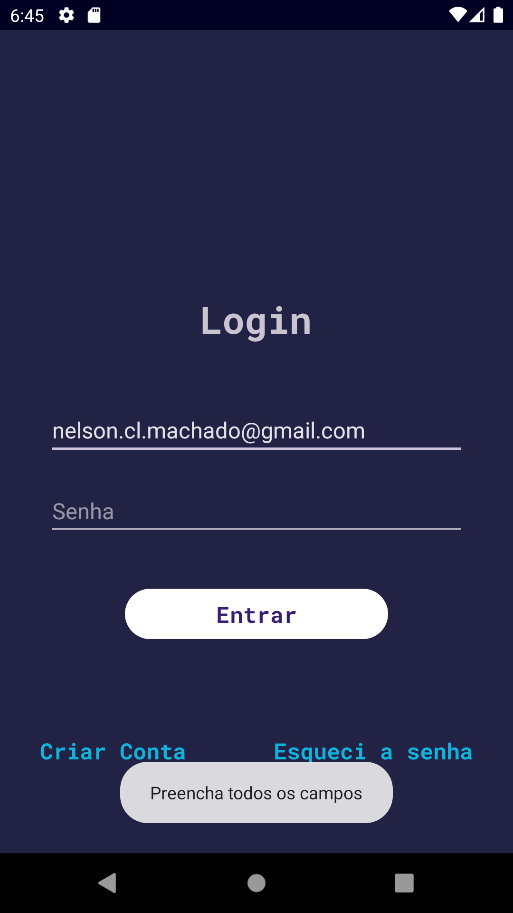
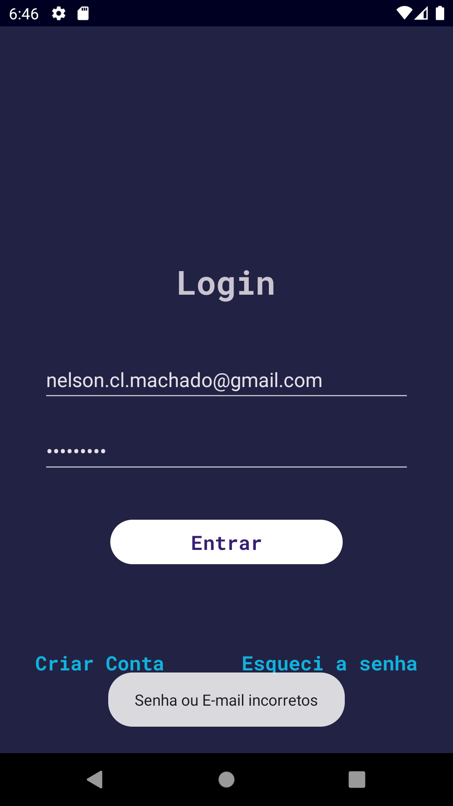
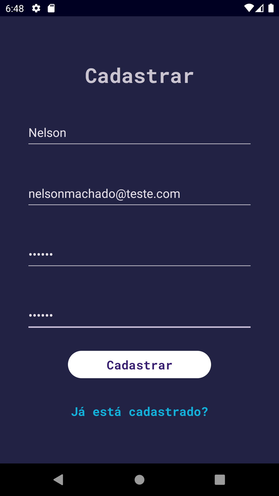
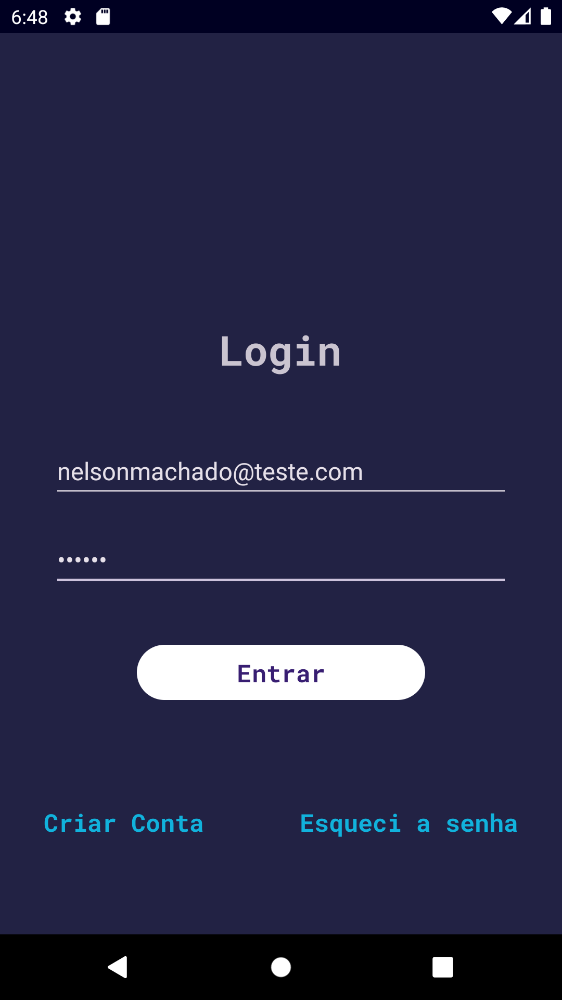

# Login Java - Android
Aplicação Android feito em Java com Login, Cadastro e Redefinição de Senha utilizando a ferramenta e banco de dados Firebase. 

## Screenshots
            

## Sobre o Desenvolvimento
Graças ao documento do Firebase descrever e colocar exemplos de como conectar e interagir com suas ferramentas, não houve grandes complicações em relação essa parte. Para o design de telas, foi estruturado para ser simples e com a capacidade de possuírem modo noturno e não-noturno, também utilizando do Theme para facilitar atualizações. Por fim, foi adicionado um método de callback para ser executado ao pressionar um botão, isso foi colocado para demonstrar o estado da comunicação com o Firebase, também foram adicionados Toast que aparecerem informando o erro do usuário.
